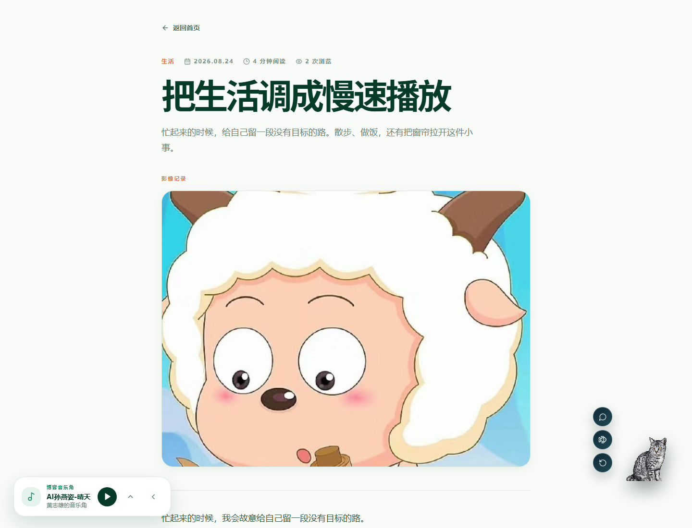

# 黄志雄的个人数字花园

> 把代码、远行、美食、音乐和日常里的小事，认真记录成可以再次打开的记忆。

[](https://my-blog-two-puce.vercel.app)
[](https://nextjs.org/)
[](https://www.typescriptlang.org/)

这是一个基于 Next.js 的全栈个人博客。除了文章，也可以记录旅行、美食、音乐、照片与 Vlog；内容通过独立的管理页面维护，并部署在 Vercel 上。前台还加入了旅行地图、可收起的音乐播放器和互动猫咪 CyberCat。

## 页面预览

### 首页


### 文章详情



## 功能

- **多主题文章**：按技术、美食专栏、旅行、生活、思考和成长等分类记录内容。
- **文章详情与浏览量**：文章卡片可从图片或标题进入详情；详情页展示摘要、正文、标签、图片或视频，并记录浏览量。
- **旅行足迹地图**：保存城市、地点、日期、坐标和照片；地图使用 Leaflet 与 OpenStreetMap 底图，并可标记家所在地。填写地点后可通过高德地理编码服务获取坐标。
- **音乐角**：播放博客歌单，可收起到页面边缘，减少对阅读和移动端内容的遮挡。
- **图片与 Vlog**：文章和旅行记录可附带图片、视频等媒体。
- **互动 CyberCat**：包含待机、眨眼、舔爪、翻滚、吃鱼和摸头等互动；配置 AI 服务后可进行开放式聊天，也可回答天气类问题。
- **独立后台入口**：登录后分别管理文章、旅行、音乐和站点资料；后台支持媒体上传。
- **响应式页面**：针对桌面和窄屏调整导航、播放器、猫咪及内容布局。

## 技术栈

- **应用**：Next.js 14 App Router、React 18、TypeScript、Tailwind CSS
- **动效与图标**：Framer Motion、Lucide React
- **地图**：Leaflet、React Leaflet、OpenStreetMap；高德 Web 服务负责地点地理编码
- **接口**：Next.js Route Handlers
- **登录**：HTTP-only Cookie 与 HMAC 会话签名
- **持久化**：本地开发使用 `data/*.json`；线上使用 Supabase PostgreSQL，媒体文件使用 Supabase Storage
- **托管**：GitHub + Vercel

## 本地启动

需要先安装 Node.js 和 npm。在项目根目录运行：

```bash
npm install
```

复制环境变量模板并填写后台登录配置：

```powershell
# Windows PowerShell
Copy-Item .env.local.example .env.local
```

```bash
# macOS / Linux / Git Bash
cp .env.local.example .env.local
```

本地开发可以不配置 Supabase，项目会读写 `data/*.json`。至少设置独立的管理员密码和会话密钥，然后启动：

```bash
npm run dev
```

- 前台：<http://localhost:3000>
- 后台：<http://localhost:3000/admin>

## 环境变量

| 变量 | 用途 | 是否必需 |
| --- | --- | --- |
| `BLOG_ADMIN_PASSWORD` | 后台登录密码；生产环境请使用强密码 | 使用后台时必需 |
| `BLOG_SESSION_SECRET` | HMAC 会话签名密钥，建议使用至少 32 位随机值 | 使用后台时必需 |
| `SUPABASE_URL` | Supabase 项目地址 | 使用线上数据库时必需 |
| `SUPABASE_SECRET_KEY` | 服务端数据库与存储操作密钥；旧版项目也可使用 `SUPABASE_SERVICE_ROLE_KEY` | 使用线上数据库时必需，二选一 |
| `NEXT_PUBLIC_SUPABASE_URL` | 浏览器端 Supabase Storage 上传地址 | 启用浏览器直传时必需 |
| `NEXT_PUBLIC_SUPABASE_ANON_KEY` | Supabase anon / publishable 公钥 | 启用浏览器直传时必需 |
| `AMAP_API_KEY` | 高德 Web 服务 Key，用于旅行地点地理编码 | 可选 |
| `OPENAI_API_KEY` | OpenAI 兼容聊天服务密钥，用于 CyberCat AI 对话 | 可选 |
| `OPENAI_BASE_URL` | 聊天服务 API 地址；默认 `https://api.openai.com/v1` | 可选 |
| `OPENAI_MODEL` | 聊天模型名称；默认 `gpt-4o-mini` | 可选 |

**安全提示：** `SUPABASE_SECRET_KEY`、`SUPABASE_SERVICE_ROLE_KEY`、`OPENAI_API_KEY`、管理员密码和会话密钥都只能保存在服务端环境变量中。不要使用 `NEXT_PUBLIC_` 前缀，也不要提交 `.env.local` 或把密钥粘贴到公开页面。浏览器端变量只填写 anon / publishable 公钥。

## Supabase 线上持久化

如果要让 Vercel 上后台新增或编辑的内容在重新部署后仍然保留：

1. 创建 Supabase 项目，在 SQL Editor 执行 [`supabase/schema.sql`](supabase/schema.sql)。脚本会创建 `public.blog_content` 表和公开读取的 `blog-media` 媒体桶；内容表只由服务端密钥访问。
2. 在 Vercel 项目的 **Settings → Environment Variables** 配置 `SUPABASE_URL`、`SUPABASE_SECRET_KEY`（或旧版 `SUPABASE_SERVICE_ROLE_KEY`）。使用浏览器直传媒体时，再配置 `NEXT_PUBLIC_SUPABASE_URL` 与 `NEXT_PUBLIC_SUPABASE_ANON_KEY`。
3. 如需将仓库内的初始 JSON 内容导入 Supabase，先在本地 `.env.local` 配好数据库变量，再运行预览：

   ```bash
   npm run supabase:import
   ```

   确认导入清单后再执行：

   ```bash
   npm run supabase:import -- --apply
   ```

   导入脚本以新增缺失内容为主，不会覆盖线上已存在的数据；执行前仍建议备份并检查目标项目。
4. 在 Vercel 保存变量并重新部署。此后后台内容写入 Supabase，媒体写入 Supabase Storage；Vercel 函数本地文件系统不适合作为线上持久化存储。

不配置 Supabase 时，本地开发会使用 JSON 文件。生产环境缺少数据库配置时，后台保存应报错，而不是把数据写进部署实例的临时文件系统。

## 常用接口

| 方法 | 路径 | 说明 |
| --- | --- | --- |
| `GET` | `/api/health` | 服务健康检查 |
| `GET` | `/api/posts` | 已发布文章列表；支持分类和分页参数 |
| `GET` | `/api/posts/:slug` | 获取文章详情 |
| `POST` | `/api/posts/:slug/view` | 增加文章浏览量 |
| `GET` | `/api/journeys` | 公开旅行记录 |
| `GET` | `/api/music` | 公开音乐列表 |
| `GET`, `POST` | `/api/chat` | 查询聊天配置状态或发送 CyberCat 对话 |
| `GET` | `/api/geocode` | 调用高德服务查询地点坐标 |
| `POST` | `/api/admin/login` | 管理员登录 |
| `GET`, `POST` | `/api/admin/posts` | 管理文章列表、新建文章（需登录） |
| `GET`, `PATCH`, `DELETE` | `/api/admin/posts/:id` | 查询、编辑或删除文章（需登录） |
| `GET`, `POST` | `/api/admin/journeys` | 管理旅行记录（需登录） |
| `GET`, `POST` | `/api/admin/music` | 管理音乐列表（需登录） |
| `POST` | `/api/admin/upload` | 上传媒体（需登录） |

旅行、音乐、首页资料和其他管理接口也位于 `app/api/admin/` 下，并通过后台会话校验。

## 项目结构

```text
app/                  页面、文章详情与 API Route Handlers
components/blog/      前台页面、地图、音乐播放器和 CyberCat
components/admin/     后台管理界面
lib/server/           服务端认证、数据访问与持久化逻辑
data/                 本地开发使用的 JSON 数据
public/               静态图片、音频、视频及动画素材
supabase/schema.sql   Supabase 数据表和 Storage 初始化脚本
docs/screenshots/     README 页面截图
```

## 检查与部署

项目提供以下检查命令：

```bash
npm run lint
npm run typecheck
npm run build
```

部署时将 GitHub 仓库连接到 Vercel，由 Vercel 构建 Next.js 应用。使用后台前，先在 Vercel 配置管理员密码、会话密钥；线上数据持久化还需要配置 Supabase 变量并执行初始化 SQL。

- GitHub：<https://github.com/hzx1211/my-blog>
- 在线站点：<https://my-blog-two-puce.vercel.app>

## 内容与素材说明

仓库没有因此授予照片、音乐、视频或文章素材的转载和商用权限。公开前请确认你对上传内容具有相应使用权；不要提交个人密钥、`.env.local` 或不打算公开的原始材料。

